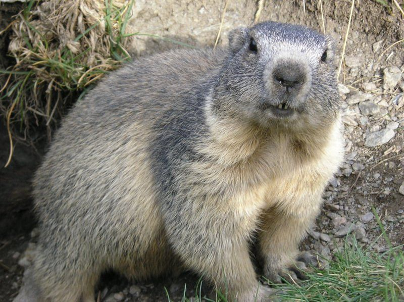

<h1 align="center">Go Studies Notes 🖊️📘</h1>

<h1 align="center">
  
</h1>

> Useful links: 

### [Course "Aprenda Go" PT-BR](https://www.youtube.com/channel/UCxD5EE0H7qOhRr0tIVsOZPQ) A introduction course to learn basic of language
  

### [Go by example](https://gobyexample.com/) A website with small examples about each language theme

### [Facebook group PT-BT](https://pt-br.facebook.com/groups/golang.br/) A facebook group focused on Go

### [Full Cycle Course PT-BR](https://www.youtube.com/watch?v=_MkQLDMak-4&list=PL5aY_NrL1rjucQqO21QH8KclsLDYu1BIg) A YouTube course focused on Go

### [PGK.GO](https://pkg.go.dev/) Website with documentation about each package GO
